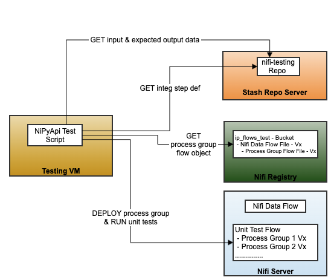
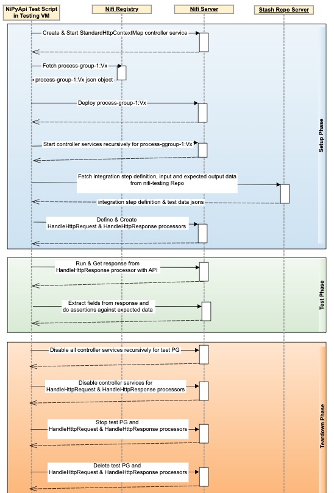

### Nifi Flow Unit Testing
 <br/>


This is a Nifi Flow Testing Framework built upon NiPyApi, a Python client SDK for Apache NiFi. We can run flow tests without writing single line of code, regardless of the complexity of your data flow. Framework provides automation to run Nifi, Nifi Registry and all the dependent services in docker containers, deploy flow from Registry, setup test data, run the tests and clean-up the data.

#### Documentation
* [NiPyApi - A Python Client SDK for Apache NiFi](https://nipyapi.readthedocs.io/en/latest/index.html)
### Developer Guide
#### Local Development
Below are the steps for local setup to develop flow unit tests in python and run on Nifi Server and Nifi Registry running in docker containers.  
* Install
    * Python 3.11, PIP, NiPyApi & ODBC Driver and MS SQL Tools
        * Any Operating System 
         ```
          curl https://bootstrap.pypa.io/get-pip.py -o get-pip.py
          python3 get-pip.py
          pip3 install nipyapi pytest jsonpath_ng gitpython repo python-dotenv jproperties more-itertools hvac python-dateutil psycopg2-binary pyodbc
         ```
	* [Docker Desktop](https://www.docker.com/products/docker-desktop)
* Run & Configure
    * Start Nifi, Nifi Registry & Vault in Docker containers 
        ```
         cd docker
         docker-compose up -d
        ``` 
#### Run Flow Unit Tests
* Add Nifi self-signed certificates to KeyChain (Mac) or "Local Machine Certificate Store" (Windows), we have 2 options here
  * Add pre-generated certificates from repo
    * Open "KeyChain Access"
    * Drag and Drop certificate - 'docker/nifi-certs/nifi-cert.pem' into KeyChain
    * Import the NiFi certs to keychain and mark it as trusted
* Add 'nifi' host running in docker to your local hosts file
  * sudo sh -c "echo 127.0.0.1 nifi >> /etc/hosts"
* If you are using SSL for both Nifi and Nifi Registry do below steps -
  * sudo sh -c "echo 127.0.0.1 nifi-registry-ssl >> /etc/hosts"
  * Go to nifi-testing/docker/nifi-certs folder
  * Open "CN=admin_OU=NiFi.password" and copy password
  * Open "CN=admin_OU=NiFi.p12" and paste password
  * In Nifi Registry UI
    * Create a user same as Subject name of your nifi certificate - "CN=nifi, OU=NIFI"
    * Grant below permissions to the user
      * Can manage buckets - Read / Write / Delete
      * Can proxy user requests - Read / Write / Delete
      * Bucket - Read / Write
    * Create bucket if not exists - "nifi-testing"
    * Import sample flow from docker/nifi-flows/test-flow.json into the Nifi Registry
      * NiFi Registry Import URL: https://<local-nifi-registry-ssl-hostname:port>/nifi-registry/#/explorer/grid-list
    * Update flow_version_mapping (routing version) in test.properties to match the local NiFi Registry Flow version (Refer above screenshot for versions)  
* Run Nifi Flow python test script
    ```
     cd src
     py flow_unit_test.py
    ``` 
## Additional settings for test files

Any of the following fields can be added to the 'settings' section of the test files
```
"settings": {
    "load_file_type": "binary",
    "skip_replace_text_in": "true",
    "skip_check_out_content": "true",
    "subprocess": {
        "before": "docker cp ../test-data/tc1.txt nifi:/opt/nifi/simple.txt\"",
        "after": "docker exec nifi rm /opt/nifi/simple.txt"
    }
}

```
- load_file_type: binary or text (default is text). specifies the mode the '$.input.flow_content.file_name' should be read from the disk
- skip_replace_text_in: if true, the replace text in processor is skipped
- skip_check_out_content: if true, the output content is not verified against '$.output.flow_content.file_name'
   


